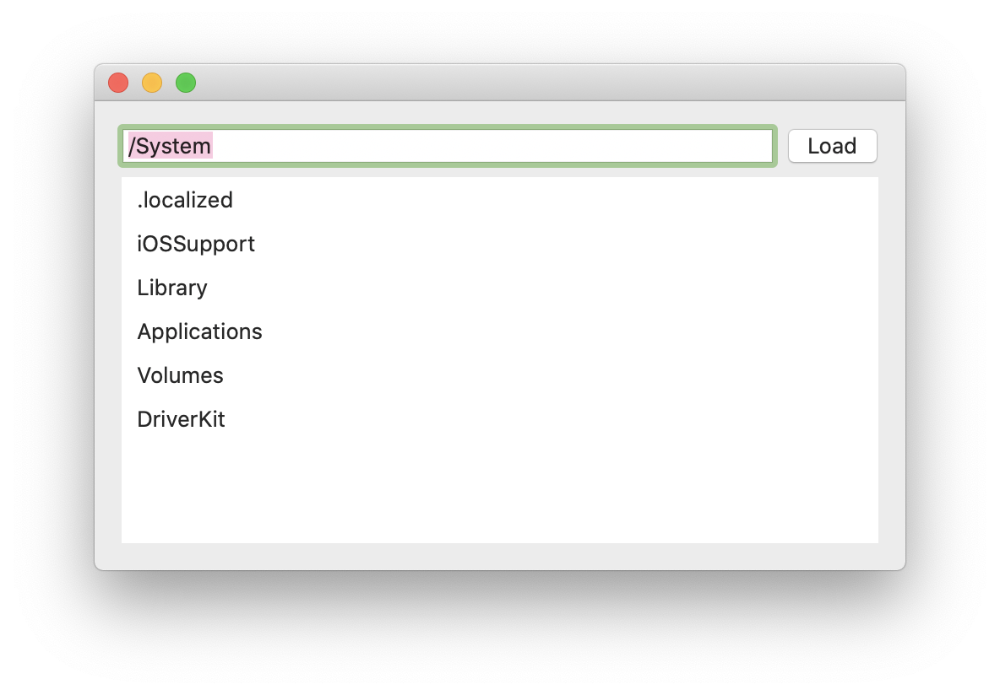
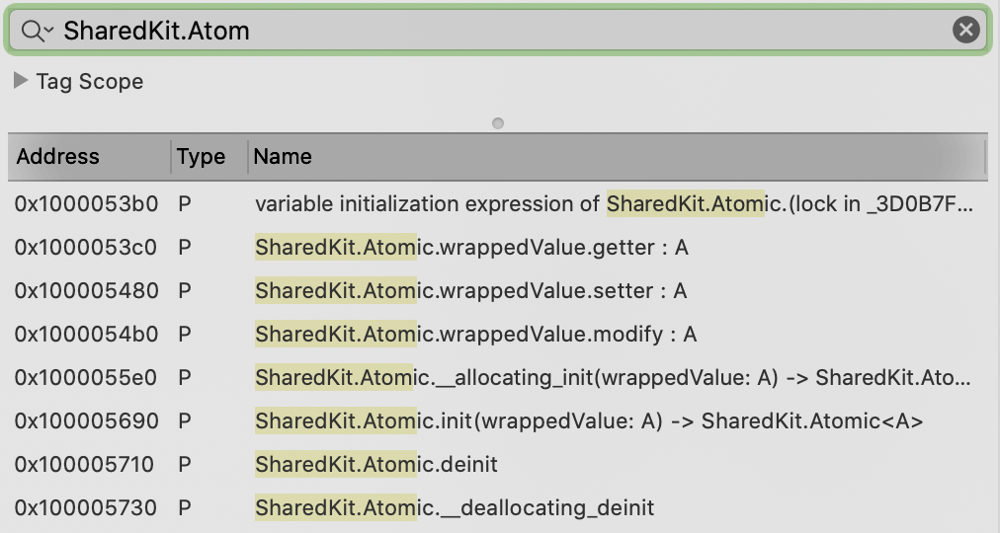
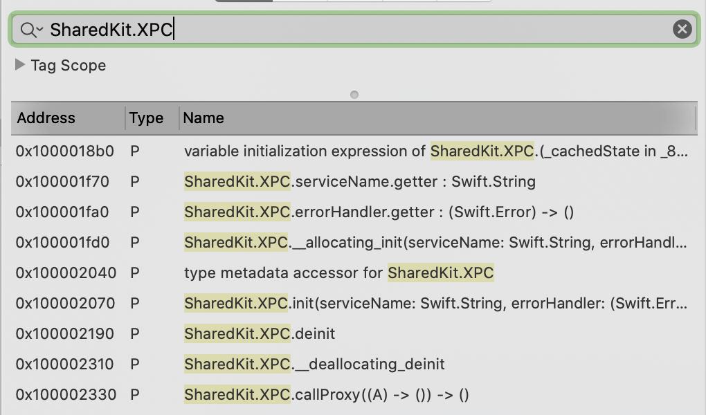

# SwiftXPC

This repo contains a Mac app and a XPC service both written in pure Swift.

## Installation

Clone this folder and open the `SampleApp.xcworkspace` in Xcode, then hit Run to launch the app.

## Sample App

`SampleApp` is a directory reader written in SwiftUI:

## Sample XPC

`SampleXPC` is a service written in Swift.

## Shared Kit

`SharedKit` is a Swift package with reusable code for the Mac app and for the XPC service.

# LTO

If we Archive the app and check binaries in Hopper, unfortunately the dead code from SharedKit is not stripped.

These are unused symbols in the Mac app:

These are unused symbols in the XPC service:

Please make a pull request if you know how to reduce a bundle size.